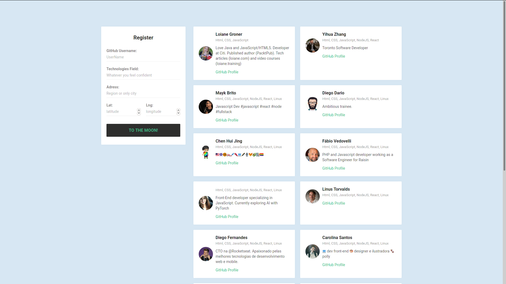

<!-- PROJECT LOGO -->
<br />
<p align="center">
  <a href="https://google.com/">
    
  </a>

  <h3 align="center">Radar Dev  WEB</h3>

  <p align="center">
    Um projeto SPA criado com REACT.
    <br />
    
  </p>
</p>

### About
Projetado para suprir minimamente a interação do usuário, esse modelo cria interfaces comuns de design de WEB e permite distribuir rapidamente seus dados.  
Esse SPA faz parte do projeto OminiStack. 

### Features
+ Versioning
+ Support for various data stores
+ Tests
+ Flexibility
+ Extensibility
+ The Javascript you know and love
+ Minimal abstractions


### Print Screen



### Install
````
git clone https://github.com/diegodario88/Radar-Dev-WEB.git

cd Radar-Dev-WEB

npm install

````

### Start
````
npm start
````

The API runs on port ````3000```` by default, and the root can be accessed by navigating to http://localhost:3000 in your browser.

### Author
[Diego Dario](https://github.com/diegodario88).

### License
CC-BY for all code unique to this API.
